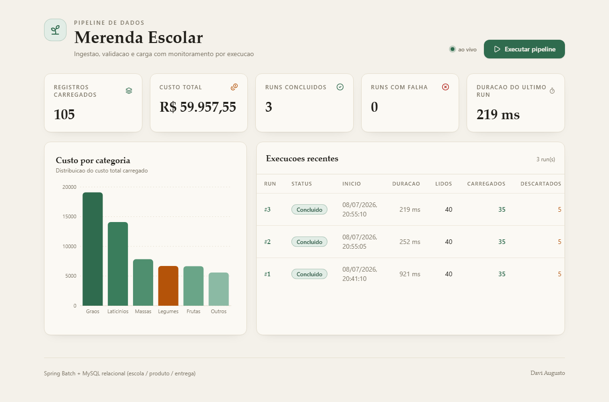
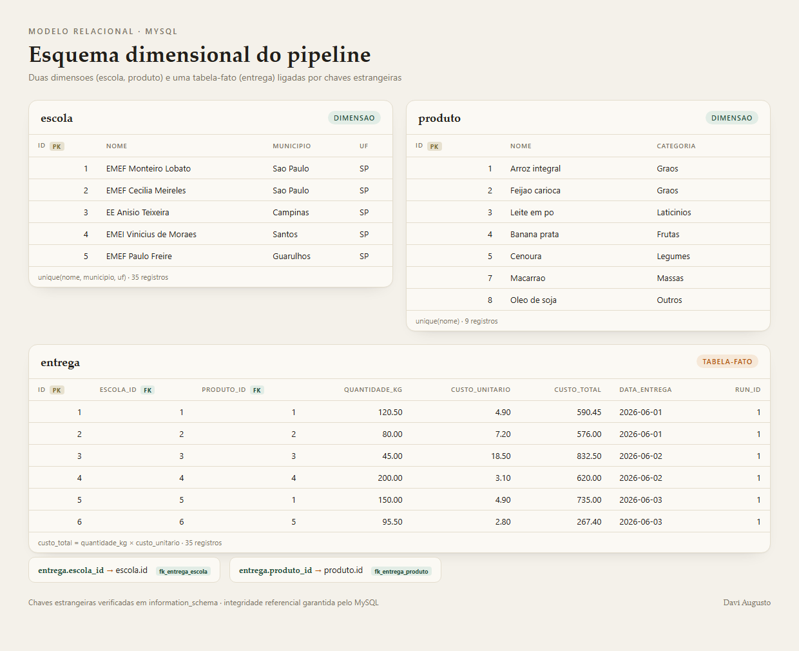

# ETL Pipeline - Entregas de Merenda Escolar

[](https://openjdk.org)
[](https://spring.io/projects/spring-boot)
[](https://spring.io/projects/spring-batch)
[](https://www.mysql.com)
[](https://react.dev)
[](https://vite.dev)
[](https://tailwindcss.com)

Pipeline **ETL** (Extract, Transform, Load) que ingere dados de entregas de merenda escolar a partir de um CSV, valida e transforma cada registro, carrega o resultado em um banco **MySQL** e expoe um **dashboard de monitoramento** que acompanha cada execucao em tempo real. A orquestracao usa **Spring Batch** com processamento orientado a chunk e tolerancia a falhas.

## Screenshots

### Dashboard de monitoramento


### Modelo relacional (MySQL)


## Funcionalidades

| Funcionalidade | Descricao |
|---|---|
| **Pipeline ETL** | Job Spring Batch com etapas Extract (CSV), Transform (validacao/normalizacao) e Load (insercao em lote no MySQL) |
| **Tolerancia a falhas** | Registros invalidos sao descartados via skip policy e contabilizados, sem abortar a execucao |
| **Execucao sob demanda** | Disparo assincrono via API; o dashboard acompanha o run do inicio ao fim |
| **Monitoramento** | Lista de execucoes com status, duracao e contagens (lidos, carregados, descartados) |
| **Metricas dos dados** | Total de registros, custo total consolidado e distribuicao por categoria |
| **API documentada** | OpenAPI/Swagger UI para todos os endpoints |
| **Health check** | Endpoint de saude do servico e do banco via Spring Boot Actuator |

## Arquitetura

```
etl-pipeline/
├── backend/                              # Java 17 + Spring Boot + Spring Batch
│   ├── docker-compose.yml                # MySQL 8 para desenvolvimento
│   └── src/main/java/com/portfolio/etl/
│       ├── EtlPipelineApplication.java
│       ├── config/
│       │   ├── BatchConfig.java          # Job, Step (chunk), reader e writer
│       │   ├── AsyncBatchConfig.java     # JobLauncher assincrono
│       │   ├── EtlProperties.java        # Parametros do pipeline (fonte, chunk)
│       │   ├── WebConfig.java            # CORS
│       │   ├── OpenApiConfig.java        # Metadados Swagger
│       │   └── GlobalExceptionHandler.java
│       ├── batch/
│       │   ├── mapper/                    # CSV -> DTO cru
│       │   ├── processor/                 # Transform: valida, normaliza, calcula custo
│       │   ├── writer/                    # Load dimensional: get-or-create + fato
│       │   ├── listener/                  # Log de skips e resumo do job
│       │   └── InvalidRecordException.java
│       ├── domain/
│       │   ├── dto/                        # RawDeliveryRecord, ValidatedDelivery
│       │   └── model/                      # Escola, Produto, Entrega (relacional)
│       ├── pipeline/                      # Disparo do pipeline (service + controller)
│       ├── monitoring/                    # Leitura de runs e metricas (service + controller)
│       └── repository/                    # Escola/Produto/Entrega + agregacoes
├── frontend/                             # React + JavaScript (Vite)
│   └── src/
│       ├── App.jsx                        # Orquestra o polling (2s)
│       ├── api/client.js                  # Client HTTP
│       ├── utils/format.js                # Formatacao (moeda, duracao, status)
│       └── components/
│           ├── Header.jsx                 # Titulo + botao de execucao
│           ├── StatsCards.jsx             # Cards de metricas
│           ├── CategoryChart.jsx          # Custo por categoria (Recharts)
│           └── ExecutionsTable.jsx        # Historico de execucoes
└── README.md
```

## Fluxo do pipeline

```
CSV (entregas_merenda.csv)
   │
   ├─ Extract   FlatFileItemReader le as linhas do CSV
   ├─ Transform DeliveryItemProcessor valida campos, normaliza UF/textos,
   │            converte tipos e calcula custo_total = quantidade x custo_unitario
   │              └─ registro invalido -> InvalidRecordException -> descartado (skip)
   ├─ Load      EntregaItemWriter resolve as dimensoes (escola/produto) com
   │            get-or-create e grava a tabela-fato entrega com as chaves estrangeiras
   └─ Metadados Spring Batch registra o run (status, contagens, duracao)
                  └─ o dashboard consulta esses metadados via JobExplorer
```

## Stack Tecnica

| Camada | Tecnologia | Versao |
|---|---|---|
| Backend | Java | 17 |
| Framework | Spring Boot | 3.3.5 |
| Orquestracao ETL | Spring Batch | 5 |
| Persistencia | Spring Data JPA + MySQL | 8 |
| Documentacao | springdoc-openapi (Swagger) | 2.6 |
| Frontend | React | 19 |
| Linguagem | JavaScript | ES2022 |
| Build Tool | Vite | 8 |
| Estilizacao | Tailwind CSS | 4 |
| Graficos | Recharts | 2 |
| Animacoes | Framer Motion | 12 |
| Icones | Lucide React | - |

## API REST

Base: `/api/pipeline`

| Metodo | Endpoint | Descricao |
|---|---|---|
| `POST` | `/api/pipeline/run` | Dispara uma nova execucao (assincrona); responde `202 Accepted` |
| `GET` | `/api/pipeline/runs?limit=` | Lista as execucoes mais recentes |
| `GET` | `/api/pipeline/runs/{runId}` | Detalha uma execucao |
| `GET` | `/api/pipeline/stats` | Metricas agregadas de runs e dos dados carregados |
| `GET` | `/actuator/health` | Health check do servico e do banco |
| `GET` | `/swagger-ui.html` | Documentacao interativa da API |

## Modelo de dados (relacional)

Modelo dimensional com duas dimensoes e uma tabela-fato, ligadas por chaves estrangeiras:

```
        escola                        produto
   ┌────────────────┐          ┌────────────────────┐
   │ id (PK)        │          │ id (PK)            │
   │ nome           │          │ nome (unique)      │
   │ municipio      │          │ categoria          │
   │ uf             │          └────────────────────┘
   │ uk(nome,       │                   ▲
   │    municipio,  │                   │ produto_id (FK)
   │    uf)         │                   │
   └────────────────┘                   │
            ▲                            │
            │ escola_id (FK)             │
            │              entrega       │
            │        ┌───────────────────┴────┐
            └────────│ id (PK)                │
                     │ escola_id  (FK -> escola)
                     │ produto_id (FK -> produto)
                     │ quantidade_kg          │
                     │ custo_unitario         │
                     │ custo_total            │
                     │ data_entrega           │
                     │ run_id                 │
                     └────────────────────────┘
```

**`escola`** (dimensao) — chave natural unica (`nome`, `municipio`, `uf`), `uf` normalizada em maiusculas.
**`produto`** (dimensao) — `nome` unico, com sua `categoria`.
**`entrega`** (fato) — cada registro carregado; `custo_total` = `quantidade_kg` x `custo_unitario`; `run_id` rastreia a execucao que inseriu a linha. Chaves estrangeiras `fk_entrega_escola` e `fk_entrega_produto` garantem integridade referencial.

Durante a carga, o `EntregaItemWriter` resolve as dimensoes com estrategia get-or-create (com cache por execucao), evitando duplicatas. As tabelas de metadados do Spring Batch (`BATCH_JOB_EXECUTION`, `BATCH_STEP_EXECUTION`, etc.) sao criadas automaticamente.

## Instalacao e Execucao

Pre-requisitos: **JDK 17+**, **Node 18+** e **Docker** (para o MySQL).

### 1. Banco de dados (MySQL via Docker)

```bash
cd backend
docker compose up -d
```

Sobe um MySQL 8 em `localhost:3306` (base `etl_pipeline`, usuario `etl`, senha `etl`).

### 2. Backend

```bash
cd backend
./mvnw spring-boot:run        # Windows: mvnw.cmd spring-boot:run
```

A API sobe em `http://localhost:8020`. A tabela `delivery_record` e as tabelas do Spring Batch sao criadas no primeiro start.

### 3. Frontend

```bash
cd frontend
npm install
npm run dev
```

Acesse `http://localhost:5173`. O Vite faz proxy de `/api` para o backend na porta 8020.

## Testando pela linha de comando

```bash
# Dispara uma execucao
curl -i -X POST http://localhost:8020/api/pipeline/run

# Lista as execucoes
curl -s http://localhost:8020/api/pipeline/runs | jq

# Metricas agregadas
curl -s http://localhost:8020/api/pipeline/stats | jq
```

## Testes

```bash
cd backend
./mvnw test
```

- **Teste unitario** do processor: valida transformacao, normalizacao e regras de descarte.
- **Teste de integracao** do job (banco H2 em memoria): executa o pipeline completo e valida as contagens — das 40 linhas do CSV de exemplo, 5 sao invalidas e descartadas, restando 35 registros carregados.

## Qualidade dos dados

O CSV de exemplo inclui, propositalmente, linhas invalidas (custo ausente, quantidade negativa, data em formato errado, escola ou produto vazios) para demonstrar a validacao e o descarte controlado na etapa Transform, com o motivo de cada rejeicao registrado em log.

## Contexto

Projeto de portfolio na area de **dados / backend**, demonstrando um pipeline ETL de nivel de producao:
- Processamento em lote orientado a chunk com Spring Batch
- Separacao clara entre Extract, Transform e Load
- Tolerancia a falhas e rastreabilidade de qualidade de dados
- Observabilidade das execucoes por meio dos metadados do batch
- Dashboard de monitoramento desacoplado, consumindo a API REST

---

Desenvolvido por **Davi Augusto** | [GitHub](https://github.com/Gaveta-cmd)
